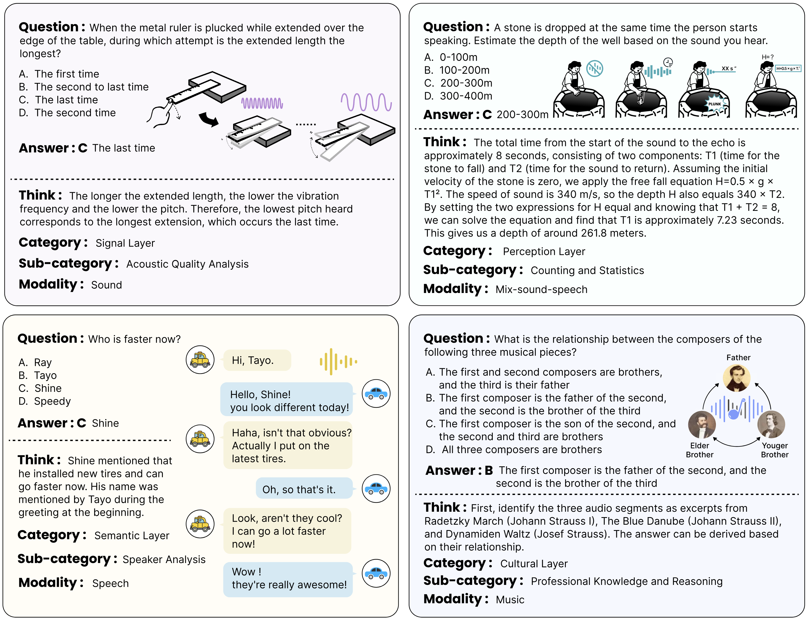
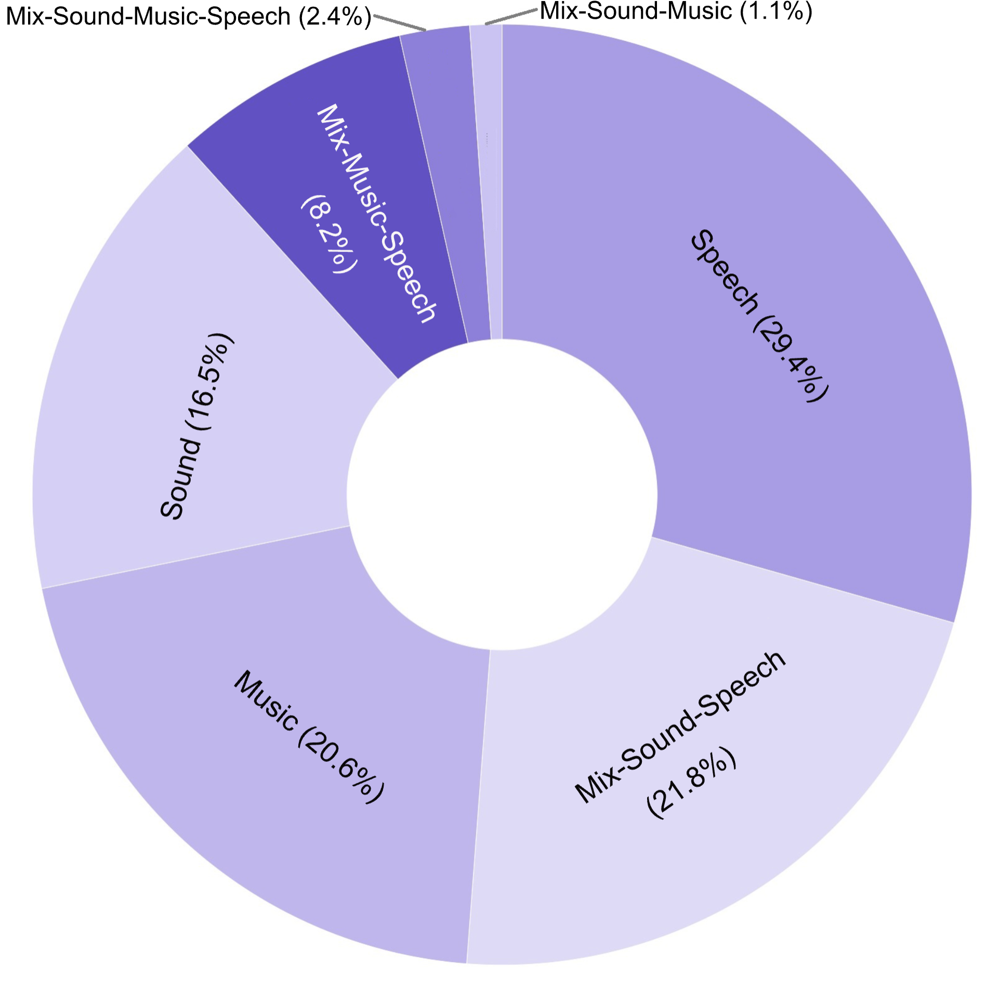
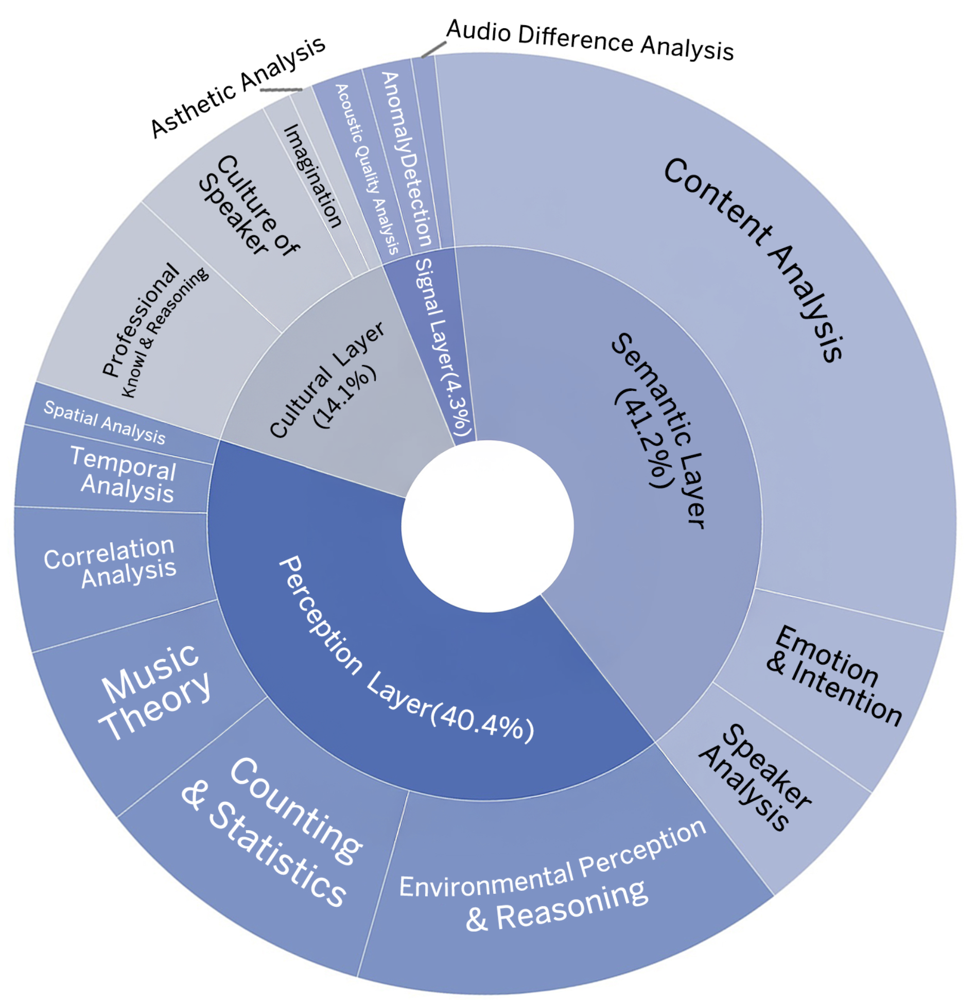
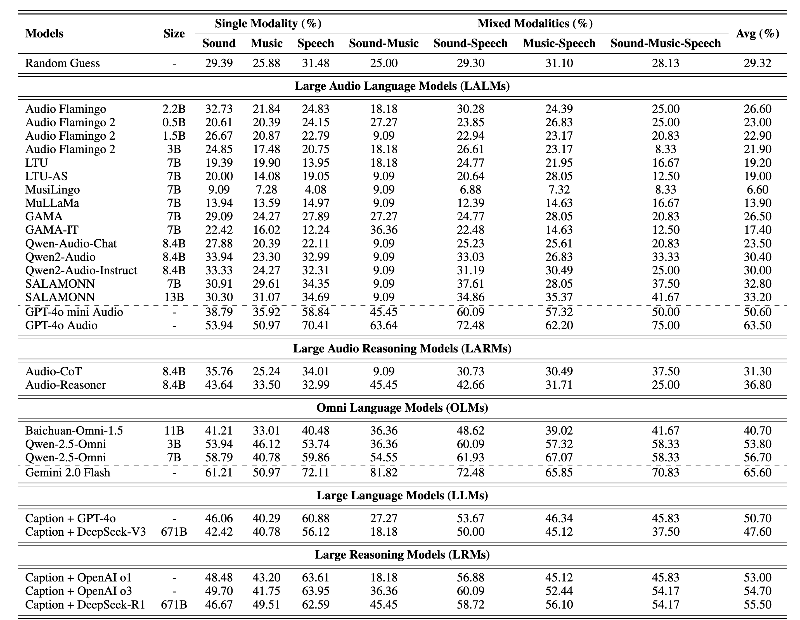
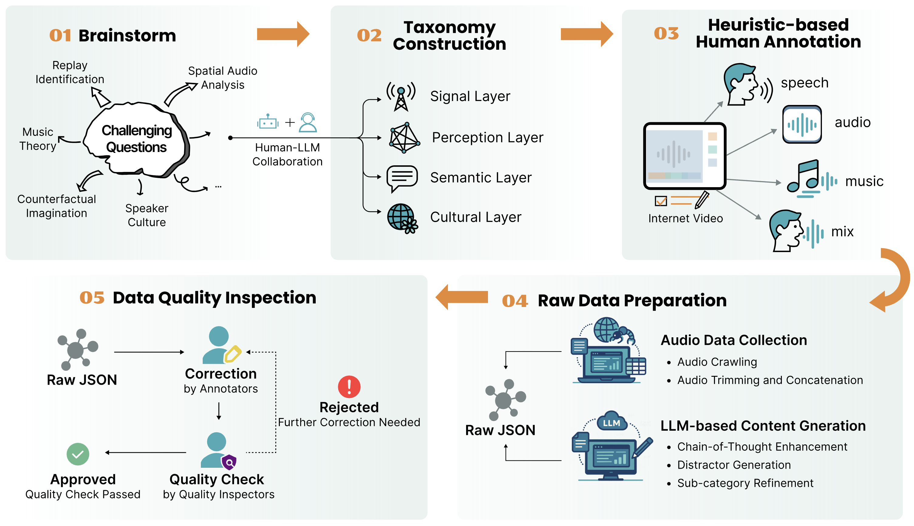

# MMAR: A Challenging Benchmark for Deep Reasoning in Speech, Audio, Music, and Their Mix
[**📖 arXiv (Comming Soon)**]() | [**🎬 MMAR Demo Video**](https://www.youtube.com/watch?v=Dab13opIGqU) | [**🔊 MMAR Audio Download (HuggingFace)**](https://huggingface.co/datasets/BoJack/MMAR) |[**🔊 MMAR Audio Download (Google Drive)**](https://drive.google.com/file/d/1AkAbrD1GNFimMxBqAXFc5ve6fc3RgLLv/view?usp=sharing)
                                          
<p align="center"></p>

## Overview of MMAR
We introduce MMAR, a new benchmark designed to evaluate the deep reasoning capabilities of Audio-Language Models (ALMs) across massive multi-disciplinary tasks. 
MMAR comprises 1,000 meticulously curated audio-question-answer triplets, collected from real-world internet videos and refined through iterative error corrections and quality checks to ensure high quality. 
Each item in the benchmark demands multi-step deep reasoning beyond surface-level understanding. Moreover, a part of the questions requires graduate-level perceptual and domain-specific knowledge, elevating the benchmark's difficulty and depth. 
Examples include:



The metadata for MMAR is available in [this file](MMAR-meta.json). Unlike previous benchmarks, MMAR not only covers traditional modalities such as speech, audio, and music, but also extends to their mix, collected from in-the-wild videos. The distribution of data across these modalities is illustrated in the left figure. Furthermore, each question is annotated with a designated category and sub-category, as shown in the right figure.

For each question, we also provide the URL and corresponding timestamp of the original video, as well as the spoken language (if present) in the clip. To prevent potential data leakage into training for reasoning models, we have withheld reasoning cues and chain-of-thought annotations, which will be released at an appropriate time.

<p float="left">
  
  
</p>

## Benchmark Results
We benchmark the models on MMAR across five model categories: 
1. Large Audio Language Models (LALMs)
2. Large Audio Reasoning Models (LARMs)
3. Omni Language Models (OLMs)
4. Large Language Models (LLMs) with audio captions as input
5. Large Reasoning Models (LRMs) with audio captions as input



## Dataset Creation
The MMAR benchmark was constructed with a comprehensive pipeline. The process includes: 
1. Brainstorming challenging questions
2. Building a taxonomy through human-LLM collaboration
3. Heuristic-based data collection and annotation
4. Crawling audio data and enriching content across multiple slots
5. Performing iterative correction and quality inspection to ensure high data fidelity



## Test Your Model !

To ensure a smooth integration into existing evaluation pipelines, we adopt an evaluation methodology modified from [MMAU](https://github.com/Sakshi113/MMAU), implemented in [evaluation.py](code/evaluation.py). The input to the evaluation script should be the same as [MMAR-meta.json](MMAR-meta.json), with an additional key named `model_prediction`, which stores the model prediction for each question. 
  
To run the script:
```bash
python evaluation.py  --input INPUT_JSON_PATH
```

## Acknowledge
We gratefully acknowledge that our evaluation code is modified from the official implementation of [MMAU](https://github.com/Sakshi113/MMAU). 

## Citation
Coming Soon